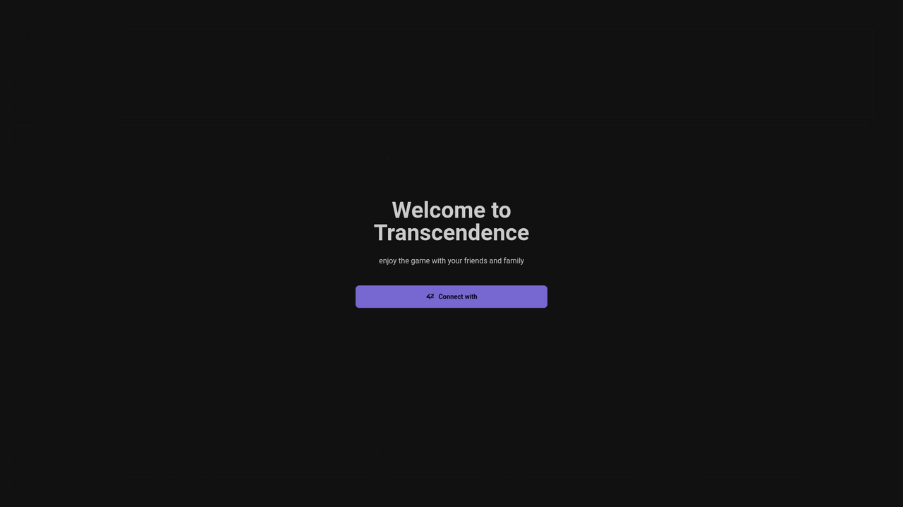

    

    
    
    
    
    

# 42 Transcendence
An online multiplayer Pong experience.

## Features
- Real-time Multiplayer Pong Game
- Social Features (chat functionalities, friend list, user profiles, etc.)
- Matchmaking System
- Authentication and Security (OAuth, 2FA)

## Authors
- [Vinicius Oliveira (vgoncalv)](https://github.com/vinicius507)
- [Lucas Pires (lpires-n)](https://github.com/iLucasPires)
- [Marcelo (marcrodr)](https://github.com/meritissimo1)